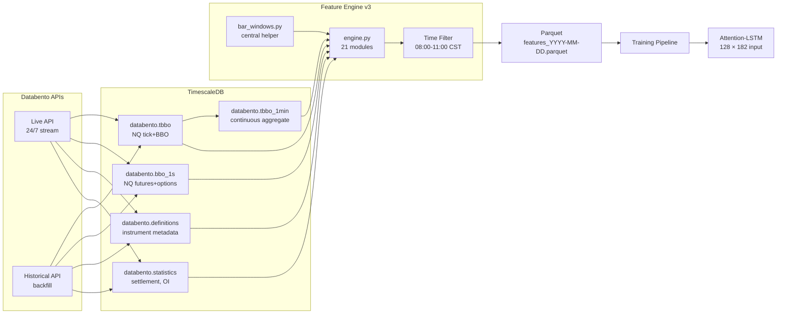
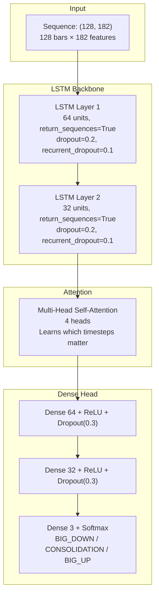
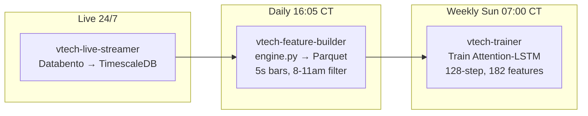

# DATABENTO VM ARCHITECTURE — v3

**Date:** 2026-04-06
**Previous:** v2 (10s bars, 138 features, no time filter)
**Version:** v3 — 5s bars, 182 features, 8–11am CST filter

---

## 1. System Overview

```
┌──────────────────────────────────────────────────────────────┐
│  Oracle Cloud VM  ·  4 vCPU AMD EPYC  ·  31 GB RAM  ·  No GPU │
│  Ubuntu 22.04  ·  Python 3.12  ·  PostgreSQL 18  ·  TimescaleDB│
├──────────────────────────────────────────────────────────────┤
│  /opt/vtech/                                                   │
│    src/acquisition/  ← Databento live + historical downloaders │
│    src/ingestion/    ← DBN → TimescaleDB loader                │
│    src/features/     ← 21 feature modules + engine             │
│    src/training/     ← Pipeline, labels, trainer, config       │
│    src/models/       ← Attention-LSTM architecture             │
│    src/common/       ← DB pool, config, bar_windows helper     │
│    scripts/          ← Backfill, cost check, HPO               │
│    systemd/          ← Service unit files                      │
│    data/parquet/     ← Daily feature Parquet cache             │
│    data/raw/         ← Raw .dbn.zst files (retained)           │
└──────────────────────────────────────────────────────────────┘
```

---

## 2. Key v3 Parameter Changes

| Parameter | v2 | v3 | Rationale |
|-----------|----|----|-----------|
| `feature_timestep` | 10s | **5s** | Finer microstructure resolution |
| `sequence_length` | 64 bars (10.7 min) | **128 bars** (10.7 min) | Same real-time coverage at 5s |
| `forward_windows` | [5,10,15,30] bars (**BUG**: 50s–5min) | **[60,120,180,360]** bars (5/10/15/30 min) | Fix: now predicts intended horizons |
| Time filter | None (24hr data) | **08:00–11:00 CST** | Only train/predict during target session |
| Feature count | ~138 | **~182** | +10 new modules, removed equity+VIXY |
| Bars per session | 1,080/day | **2,160/day** | 3hr × 720 bars/hr |
| Training samples/year | ~254K | **~540K** | More data per iteration |
| Input tensor shape | (64, 138) | **(128, 182)** | Per-sample |
| Wavelet window | 64 bars | **128 bars** (power of 2) | Same time coverage |

---

## 3. Data Flow



---

## 4. bar_windows() — Central Window Helper

**File:** `src/common/bar_windows.py`

All feature modules use this to convert real-time window specifications to bar counts. When timestep changes, every rolling window automatically adjusts.

```python
from src.common.bar_windows import bars, bars_m

bars(30)     # 30 seconds → 6 bars @5s, 3 bars @10s
bars_m(5)    # 5 minutes  → 60 bars @5s, 30 bars @10s
bars_m(10)   # 10 minutes → 120 bars @5s
bars_m(30)   # 30 minutes → 360 bars @5s
get_timestep()  # returns "5s"
```

---

## 5. Feature Inventory — 21 Modules, ~182 Features

### 5.1 Book Pressure — `bp_` (24 features)
**Source:** BBO-1s (futures)  |  **Priority:** P1

| Feature | Description |
|---------|-------------|
| `bp_spread_mean` | Mean spread in bar |
| `bp_spread_max` | Max spread in bar |
| `bp_spread_zscore_{12,60,120}` | Spread z-score at 1m/5m/10m |
| `bp_spread_vol_{12,60}` | **NEW** Spread volatility (rolling std) |
| `bp_imbalance` | Bid/ask size imbalance (last) |
| `bp_imbalance_ma12` | Smoothed imbalance |
| `bp_imbalance_velocity_{12,60}` | **NEW** d(imbalance)/dt |
| `bp_depth_total` | Total displayed depth |
| `bp_depth_min` | Minimum depth in bar |
| `bp_depth_chg_{12,60}` | Depth change ratio |
| `bp_depth_zscore_{12,60}` | Depth z-score |
| `bp_depth_velocity_12` | **NEW** d(depth)/dt |
| `bp_bid_ask_ratio` | Persistent directional pressure |
| `bp_fleeting_bid_cv_{12,60}` | **NEW** Bid size flickering (CV) |
| `bp_fleeting_ask_cv_{12,60}` | **NEW** Ask size flickering |
| `bp_fleeting_score` | **NEW** Composite liquidity withdrawal |


### 5.2 Order Flow — `of_` (15 features)
**Source:** TBBO  |  **Priority:** P2

| Feature | Description |
|---------|-------------|
| `of_delta` | Signed volume per bar |
| `of_delta_pct` | Delta as % of total volume |
| `of_buy_ratio` | Buy fraction |
| `of_trade_count` | Trades per bar |
| `of_cvd_chg_{6,12,24,60}` | CVD change at 30s/1m/2m/5m |
| `of_delta_zscore_{6,12,24,60}` | Z-scored delta intensity |
| `of_volume_ma_60` | 5-min volume moving average |
| `of_volume_ratio` | Current/average volume |
| `of_cvd_price_divergence` | **NEW** CVD vs price disagreement |


### 5.3 Trade Location — `tl_` (3 features) **NEW**
**Source:** TBBO  |  **Priority:** P2  |  Gap #8

| Feature | Description |
|---------|-------------|
| `tl_trade_location` | Mean (trade - mid) / half_spread |
| `tl_effective_spread` | Mean 2×|trade - mid| per bar |
| `tl_aggressive_pct` | % trades at/beyond far side of spread |


### 5.4 Same-Side Runs — `ss_` (3 features) **NEW**
**Source:** TBBO  |  **Priority:** P2  |  Gap #11

| Feature | Description |
|---------|-------------|
| `ss_buy_run` | Current consecutive buy run length |
| `ss_sell_run` | Current consecutive sell run length |
| `ss_max_run_24` | Max run in trailing 2 min |


### 5.5 Large-Trade CVD — `lt_` (4 features) **NEW**
**Source:** TBBO (≥10 contracts)  |  **Priority:** P2  |  Gap #12

| Feature | Description |
|---------|-------------|
| `lt_cvd` | CVD for trades ≥10 contracts |
| `lt_cvd_chg_{24,120}` | Change over 2m / 10m |
| `lt_cvd_divergence` | sign(large) ≠ sign(total) — smart vs crowd |


### 5.6 Trade Arrival — `ta_` (3 features) **NEW**
**Source:** TBBO  |  **Priority:** P2  |  Gap #18

| Feature | Description |
|---------|-------------|
| `ta_arrival_rate` | Trades/second smoothed |
| `ta_arrival_accel` | d(rate)/dt |
| `ta_arrival_zscore_60` | Z-score of rate (5 min) |


### 5.7 Microstructure — `ms_` (7 features)
**Source:** TBBO  |  **Priority:** P5

| Feature | Description |
|---------|-------------|
| `ms_vpin` | Volume-synchronized informed trading proxy |
| `ms_kyle_lambda_60` | Price impact per unit volume (5 min) |
| `ms_vpin_zscore_{60,120}` | VPIN z-scores (5m/10m) |
| `ms_amihud_{60,120}` | **NEW** Illiquidity ratio (5m/10m) |
| `ms_amihud_zscore_120` | **NEW** Amihud z-score |


### 5.8 Realized Volatility — `rv_` (6 features) **NEW**
**Source:** Underlying price  |  **Priority:** P5  |  Gap #6

| Feature | Description |
|---------|-------------|
| `rv_realized_vol_{60,120,360}` | Rolling std of log returns (5m/10m/30m) |
| `rv_vol_of_vol_{120,360}` | Std of short-term vol (10m/30m) |
| `rv_vol_ratio` | Short/long vol — compression/expansion signal |


### 5.9 Sub-Bar Dynamics — `sd_` (8 features) **NEW**
**Source:** BBO-1s + TBBO  |  **Priority:** P5  |  Gap #14

| Feature | Description |
|---------|-------------|
| `sd_tick_count` | Trades within the 5s bar |
| `sd_price_impact_per_tick` | Bar range / tick count |
| `sd_volume_front_load` | Volume first half / total — urgency |
| `sd_bid_sz_delta` | Bid size change within bar |
| `sd_ask_sz_delta` | Ask size change within bar |
| `sd_spread_range` | Spread max − min within bar |
| `sd_mid_micro_vol` | Mid-price std within bar |
| `sd_imbalance_trajectory` | Ending − starting imbalance |


### 5.10 Volume Profile — `vp_` (5 features) **NEW**
**Source:** TBBO + underlying price  |  **Priority:** P5  |  Gap #13

| Feature | Description |
|---------|-------------|
| `vp_poc_dist` | Distance to Point of Control |
| `vp_va_high_dist` | Distance to Value Area high |
| `vp_va_low_dist` | Distance to Value Area low |
| `vp_in_value_area` | Binary: within 70% volume zone |
| `vp_poc_slope` | POC migration direction |


### 5.11 Options IV Surface — `iv_` (13 features)
**Source:** BBO-1s (options) + Definitions  |  **Priority:** P3

| Feature | Description |
|---------|-------------|
| `iv_atm_mean` | Near-the-money average IV |
| `iv_skew` | OTM put − OTM call IV |
| `iv_butterfly` | Wings − ATM IV |
| `iv_0dte_atm` | 0DTE ATM IV |
| `iv_25d_risk_reversal` | **NEW** 25-delta call − put IV |
| `iv_25d_butterfly` | **NEW** 25-delta wings − ATM |
| `iv_term_slope` | **NEW** Far − near term IV |
| `iv_atm_chg_{6,12,24}` | IV velocity (30s/1m/2m) |
| `iv_atm_zscore_{6,12,24}` | IV z-scores |


### 5.12 Dealer GEX — `gx_` (4 features) **NEW**
**Source:** BBO-1s (options) + Definitions  |  **Priority:** P3  |  Gap #25

Uses 0DTE + nearest monthly expirations only.

| Feature | Description |
|---------|-------------|
| `gx_dealer_gex` | Net dealer gamma exposure |
| `gx_gex_per_strike_max` | Gamma at highest-OI strike |
| `gx_gex_flip_dist` | Distance to GEX sign-flip price |
| `gx_gex_chg_24` | GEX rate of change (2 min) |


### 5.13 Daily Context — `dc_` (4 features)
**Source:** Statistics  |  **Priority:** P4

| Feature | Description |
|---------|-------------|
| `dc_prev_settle_dist` | Distance from prior settlement |
| `dc_daily_high_dist` | Distance from session high |
| `dc_daily_low_dist` | Distance from session low |
| `dc_oi_chg` | Open interest change |


### 5.14 Wavelets — `wv_` (14 features)
**Source:** 1-min candles  |  **Priority:** P6  
Window: 128 bars (power of 2)

| Feature | Description |
|---------|-------------|
| `wv_detail_{1,2,4,8,16,32}` | Directional coefficient per scale |
| `wv_energy_{1,2,4,8,16,32}` | Energy (squared amplitude) per scale |
| `wv_approx_slope` | Smoothest trend direction |
| `wv_fine_coarse_ratio` | Scale 1 / scale 32 energy |


### 5.15 Candle Structure — `cs_` (18 features)
**Source:** 1-min candles  |  **Priority:** P7

| Feature | Description |
|---------|-------------|
| `cs_body_range_ratio` | Body / total range |
| `cs_body_direction` | +1 / −1 |
| `cs_clv` | Close Location Value |
| `cs_clv_ma_{4,6,10,20}` | Smoothed CLV |
| `cs_upper_shadow, cs_lower_shadow` | Shadow ratios |
| `cs_range_ma_{12,60,120}` | Rolling range (1m/5m/10m) |
| `cs_vol_regime` | Range / 5m average range |
| `cs_range_chg` | Bar-to-bar range change |
| `cs_15m_body_range, cs_15m_clv` | 15-min aggregated |
| `cs_30m_body_range, cs_30m_clv` | 30-min aggregated |


### 5.16 VWAP — `vw_` (5 features)
**Source:** TBBO  |  **Priority:** P8

| Feature | Description |
|---------|-------------|
| `vw_vwap_dist` | (Price − VWAP) / VWAP |
| `vw_vwap_zscore_{60,120}` | Z-scored distance (5m/10m) |
| `vw_vwap_slope_{24,120}` | **NEW** d(VWAP)/dt at 2m/10m |


### 5.17 Cross-Asset — `ca_` (12 features)
**Source:** ES 1-min candles  |  **Priority:** P9

| Feature | Description |
|---------|-------------|
| `ca_corr_{60,120,360}` | NQ/ES correlation (5m/10m/30m) |
| `ca_ratio` | NQ/ES price ratio |
| `ca_ratio_zscore_120` | Ratio z-score |
| `ca_es_ret_lag1, lag2` | ES return lagged 1-2 bars |
| `ca_ret_divergence` | NQ − ES return |
| `ca_beta_{120,360}` | Rolling beta (10m/30m) |
| `ca_rel_strength_120` | NQ − ES cumulative return |
| `ca_es_mom_60` | ES 5-min momentum |


### 5.18 Time Context — `tc_` (22 features)
**Source:** Timestamp  |  **Priority:** P10

| Feature | Description |
|---------|-------------|
| `tc_minutes_into_session` | Minutes since 08:00 CST |
| `tc_sin_time, tc_cos_time` | Cyclical time encoding |
| `tc_dow, tc_sin_dow, tc_cos_dow` | Day of week |
| `tc_block_{open_5m, open_15m, morning}` | Session blocks |
| `tc_or{5,15,30}_{high,low}` | Opening range levels (30m **NEW**) |
| `tc_or{5,15,30}_breakout_{up,down}` | Breakout signals (30m **NEW**) |
| `tc_session_progress` | Fraction of session elapsed |


### 5.19 Economic Calendar — `ec_` (4 features) **NEW**
**Source:** Static calendar  |  **Priority:** P10  |  Gap #17

| Feature | Description |
|---------|-------------|
| `ec_is_fomc_day` | FOMC announcement day flag |
| `ec_is_cpi_day` | CPI release day flag |
| `ec_is_nfp_day` | NFP release day flag |
| `ec_minutes_to_event` | Countdown to announcement |


### 5.20 Hawkes Clustering — `hp_` (3 features) **NEW**
**Source:** Underlying price  |  **Priority:** P5  |  Gap #26

| Feature | Description |
|---------|-------------|
| `hp_large_move_ewm_60` | EWM count of large moves (5m halflife) |
| `hp_large_move_ewm_240` | EWM count (20m halflife) |
| `hp_cluster_ratio` | Recent / background intensity |


### 5.21 Higher Timeframe — `ht_` (5 features) **NEW**
**Source:** Daily OHLC from tbbo_1min  |  Constant within day

| Feature | Description |
|---------|-------------|
| `ht_daily_trend_10` | 10-day trend slope / ATR |
| `ht_daily_trend_20` | 20-day trend slope / ATR |
| `ht_daily_pos_in_range_20` | Position within 20-day range [0,1] |
| `ht_gap_pct` | Overnight gap size |
| `ht_daily_atr_ratio` | 5d ATR / 20d ATR |


---

## 6. Feature Summary

| Category | Count | Source | Update Freq |
|----------|-------|--------|-------------|
| Book Pressure (`bp_`) | 24 | BBO-1s (fut) | Every 5s bar |
| Order Flow (`of_`) | 15 | TBBO | Every 5s bar |
| Trade Location (`tl_`) | 3 | TBBO | Every 5s bar |
| Same-Side Runs (`ss_`) | 3 | TBBO | Every 5s bar |
| Large-Trade CVD (`lt_`) | 4 | TBBO | Every 5s bar |
| Trade Arrival (`ta_`) | 3 | TBBO | Every 5s bar |
| Microstructure (`ms_`) | 7 | TBBO | Every 5s bar |
| Realized Volatility (`rv_`) | 6 | Price | Every 5s bar |
| Sub-Bar Dynamics (`sd_`) | 8 | BBO-1s + TBBO | Every 5s bar |
| Volume Profile (`vp_`) | 5 | TBBO | Every 5s bar |
| Options Surface (`iv_`) | 13 | BBO-1s (opt) | Every 5s bar |
| Dealer GEX (`gx_`) | 4 | BBO-1s (opt) | Every 5s bar |
| Daily Context (`dc_`) | 4 | Statistics | Once/day |
| Wavelets (`wv_`) | 14 | 1-min candles | Every minute |
| Candle Structure (`cs_`) | 18 | 1-min candles | Every minute |
| VWAP (`vw_`) | 5 | TBBO | Every 5s bar |
| Cross-Asset (`ca_`) | 12 | ES candles | Every 5s bar |
| Time Context (`tc_`) | 22 | Timestamp | Every 5s bar |
| Economic Calendar (`ec_`) | 4 | Static | Once/day |
| Hawkes Clustering (`hp_`) | 3 | Price | Every 5s bar |
| Higher Timeframe (`ht_`) | 5 | Daily OHLC | Once/day |
| **TOTAL** | **~182** | | |

---

## 7. Model Architecture



### Training Configuration
| Parameter | Value |
|-----------|-------|
| Batch size | 64 |
| Epochs | 100 (early stop patience=10) |
| Optimizer | Adam, lr=0.001 → reduces on plateau |
| Loss | Sparse categorical crossentropy |
| Class weights | Inverse-frequency |
| Scaler | RobustScaler (fit on train) |
| Split | 70 / 15 / 15 temporal |

---

## 8. Label Generation

```
For each bar at time t:
  For each forward window w ∈ [60, 120, 180, 360] bars (= 5, 10, 15, 30 min):
    max_up   = max(price[t+1 .. t+w]) - price[t]
    max_down = price[t] - min(price[t+1 .. t+w])

    if max_up ≥ 50 points → BIG_UP (2)
    if max_down ≥ 50 points → BIG_DOWN (0)
    else → CONSOLIDATION (1)

Primary label = label_60 (5-minute horizon)
```

---

## 9. Time Filter: 08:00–11:00 CST

All feature output is filtered to **08:00–11:00 America/Chicago** before saving to Parquet. This means:

- The model only trains on the most liquid morning session
- ~2,160 bars per day (3 hours × 12 bars/min)
- Warmup bars before 08:00 are used for rolling window computation but excluded from output
- Overnight, pre-market, and afternoon data are excluded

---

## 10. Removed from v2

| Module | Features | Reason |
|--------|----------|--------|
| `equity_context.py` | 23 (NVDA/TSLA/XLK/SMH) | Daily data forward-filled to 5s — constant within day, wasted LSTM capacity |
| `macro_sentiment.py` | 10 (VIXY) | Same daily-resolution issue |
| `of_delta_sum_{w}` | 4 | Redundant with `of_delta_zscore` |
| `cs_clv_bullish_count_{w}` | 4 | Redundant with `cs_clv_ma` |
| `cs_5m_{body_range, clv}` | 2 | 128-bar sequence covers >5 min |
| `vw_{above,below}_band_{1,2}` | 4 | Binary thresholds of continuous z-score |
| `tc_block_{overnight, premarket}` | 2 | Always 0 with 8–11am filter |
| **Total removed** | **49** | |

---

## 11. Service Orchestration



| Service | Schedule | Runtime Budget |
|---------|----------|----------------|
| `vtech-live-streamer` | 24/7 | Continuous |
| `vtech-feature-builder` | Daily 21:05 UTC (16:05 CT) | ~10-20 min/day |
| `vtech-trainer` | Weekly Sun 12:00 UTC (07:00 CT) | ~3-6 hours |

---

## 12. File Inventory

```
src/common/
    bar_windows.py          ← NEW: Central timestep→bars conversion
    config.py               ← Updated: 5s, 128 seq, [60,120,180,360] windows
    db.py                   ← Unchanged

src/features/
    engine.py               ← Rewritten: 21 modules, time filter, no equity/VIXY
    book_pressure.py        ← Updated: spread_vol, fleeting, velocity
    order_flow.py           ← Updated: cvd_price_divergence, removed delta_sum
    microstructure.py       ← Updated: Amihud illiquidity
    vwap.py                 ← Updated: VWAP slope, removed bands
    time_context.py         ← Updated: 30m OR, removed overnight/premarket
    candle_structure.py     ← Updated: removed 5m, removed bullish_count
    wavelets.py             ← Updated: window=128
    cross_asset.py          ← Updated: doubled windows
    options_surface.py      ← Updated: 25d RR, term slope, butterfly
    daily_context.py        ← Unchanged
    trade_location.py       ← NEW
    same_side.py            ← NEW
    large_trade_cvd.py      ← NEW
    trade_arrival.py        ← NEW
    realized_vol.py         ← NEW
    sub_bar_dynamics.py     ← NEW
    volume_profile.py       ← NEW
    dealer_gex.py           ← NEW
    economic_calendar.py    ← NEW
    hawkes_clustering.py    ← NEW
    higher_timeframe.py     ← NEW

src/training/
    config.py               ← Updated: all defaults to v3
    data_pipeline.py        ← Updated: seq_len=128
    labels.py               ← Unchanged (forward_windows from config)
    trainer.py              ← Unchanged
```

---

## 13. Planned Next Steps

| Phase | Items | Status |
|-------|-------|--------|
| **B: Validation** | Walk-forward validation, XGBoost baseline, SHAP, probability calibration + confidence threshold (0.85) | Not started |
| **Data** | Download NQ.OPT BBO-1s (0DTE + monthly) for GEX feature activation | Pending backfill |
| **Optimization** | Run SHAP → prune bottom 20-30 features → reduce to ~150 | After first training |
