# VTech ML Workflow — NQ 50-Point Momentum Prediction

> **A complete guide to how the VTech system collects market data, engineers features, and trains a machine learning model to predict large price moves in Nasdaq-100 (NQ) futures.**
>
> Last updated: April 6, 2026

---

## Table of Contents

1. [What Does This System Do?](#1-what-does-this-system-do)
2. [End-to-End Workflow Overview](#2-end-to-end-workflow-overview)
3. [Step 1 — Data Acquisition](#3-step-1--data-acquisition)
4. [Step 2 — Data Ingestion & Storage](#4-step-2--data-ingestion--storage)
5. [Step 3 — Feature Engineering](#5-step-3--feature-engineering)
6. [Step 4 — Label Generation](#6-step-4--label-generation)
7. [Step 5 — Data Preprocessing](#7-step-5--data-preprocessing)
8. [Step 6 — Model Architecture](#8-step-6--model-architecture)
9. [Step 7 — Training Pipeline](#9-step-7--training-pipeline)
10. [Step 8 — Evaluation & Metrics](#10-step-8--evaluation--metrics)
11. [Step 9 — Hyperparameter Optimization](#11-step-9--hyperparameter-optimization)
12. [Scheduling & Automation](#12-scheduling--automation)
13. [Feature Encyclopedia](#13-feature-encyclopedia)
14. [Configuration Reference](#14-configuration-reference)
15. [Glossary](#15-glossary)

---

## 1. What Does This System Do?

**In plain English:** This system watches Nasdaq-100 futures (NQ) trades in real-time, computes ~138 mathematical indicators from that data every 10 seconds, and uses a neural network to predict whether the price will make a "big move" — up 50+ points or down 50+ points — in the near future.

**Think of it like a weather forecast for stock prices:**
- **Data collection** = weather stations gathering temperature, wind, humidity readings
- **Feature engineering** = combining those readings into useful patterns (e.g., "rapid pressure drop")
- **Model training** = teaching a computer to recognize which patterns lead to storms
- **Prediction** = "70% chance of a big upward move in the next 5 minutes"

The model classifies each 10-second bar into one of three categories:

| Class | Label | Meaning |
|-------|-------|---------|
| 0 | **BIG_DOWN** | Price expected to drop ≥50 points |
| 1 | **CONSOLIDATION** | Price expected to stay within ±50 points |
| 2 | **BIG_UP** | Price expected to rise ≥50 points |

---

## 2. End-to-End Workflow Overview

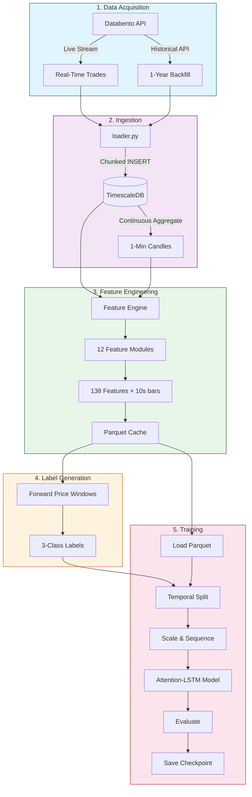

### Timeline: When Does Each Step Run?

```mermaid
gantt
    title Daily Workflow Schedule (Central Time)
    dateFormat HH:mm
    axisFormat %H:%M

    section Market Hours
    Overnight Session (Globex)       :active, 17:00, 08:30
    Regular Trading Hours (RTH)      :crit, 08:30, 15:00
    Post-Market                      :15:00, 16:00
    Evening Session Start            :active, 17:00, 18:00

    section Automated Jobs
    Live Streamer (24/7)             :done, 00:00, 24:00
    Feature Builder (daily 16:05 CT) :milestone, 16:05, 5min
    Model Trainer (Sunday 07:00 CT)  :milestone, 07:00, 30min
```

| Job | Schedule | What It Does |
|-----|----------|--------------|
| **Live Streamer** | Always running (systemd) | Captures every NQ trade + quote in real-time |
| **Feature Builder** | Daily at 16:05 CT (after market close) | Computes all 138 features for today's data |
| **Model Trainer** | Weekly on Sunday at 07:00 CT | Retrains the model on all available data |

---

## 3. Step 1 — Data Acquisition

### What is "Data Acquisition"?

This is the process of getting raw market data from Databento (our data vendor) into our system. There are two modes:

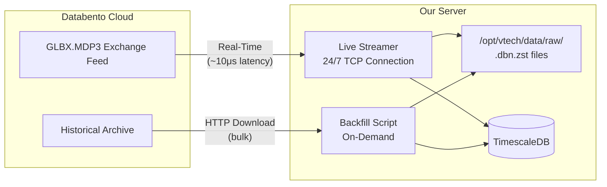

### Live Streaming (Real-Time)

The **Live Streamer** (`src/acquisition/live_streamer.py`) maintains a persistent TCP connection to Databento and subscribes to five data feeds simultaneously:

| Subscription | Data Type | Description (Plain English) |
|---|---|---|
| NQ.FUT `tbbo` | Trades with Best Bid/Offer | Every single NQ futures trade, plus the best available buy/sell prices at that instant |
| NQ.FUT `bbo-1s` | 1-Second Quote Snapshots | A snapshot of the best buy/sell prices every second |
| NQ.OPT `bbo-1s` | Options Quotes | Best prices for NQ options contracts (every second) |
| NQ.OPT `definition` | Contract Specifications | Details about each options contract (strike price, expiry date, etc.) |
| NQ.FUT `statistics` | Daily Stats | Settlement prices, daily highs/lows, open interest |

**How it works in simple terms:** Imagine a reporter sitting on the trading floor writing down every single trade that happens, plus taking a photo of the order board every second. That's what the live streamer does, 24 hours a day.

Every incoming record is:
1. Written to the database immediately (for feature computation)
2. Archived to a raw `.dbn.zst` file on disk (as a backup)

### Historical Backfill (Bulk Download)

For initial setup or filling gaps, the **Backfill Script** (`scripts/databento_backfill.py`) downloads historical data in priority order:

| Priority | Symbols | Schema | Purpose |
|----------|---------|--------|---------|
| P0 (Critical) | NQ.FUT | tbbo, bbo-1s | Core trading data — every trade and 1-second quotes |
| P1 (Important) | NQ.OPT | bbo-1s, definition | Options data for IV surface features |
| P2 (Nice-to-Have) | NQ.FUT, ES.FUT | statistics, tbbo | Daily stats and S&P 500 futures for cross-asset analysis |

**Currently loaded:** 1 year of NQ.FUT trade data (123.9 million rows), plus equity/ETF data (NVDA, TSLA, XLK, SMH, VIXY) for cross-asset features.

---

## 4. Step 2 — Data Ingestion & Storage

### What Happens to Raw Data?

Raw data arrives in Databento's proprietary `.dbn.zst` format (compressed binary). The ingestion layer converts it into a structured database:

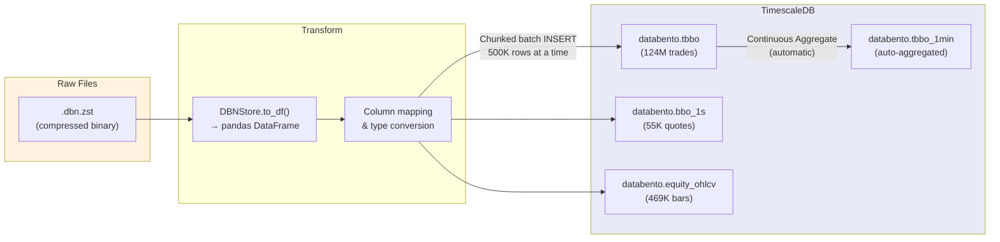

### Database Tables

| Table | Rows | What It Stores | Used For |
|-------|------|----------------|----------|
| `databento.tbbo` | 123.9M | Every NQ & ES trade + best bid/ask at that instant | Order flow, microstructure, VWAP features |
| `databento.bbo_1s` | 54.6K | 1-second snapshots of best bid/ask prices | Book pressure, spread dynamics |
| `databento.equity_ohlcv` | 469K | 1-minute bars for NVDA, TSLA, XLK, SMH, VIXY | Cross-asset and macro features |
| `databento.tbbo_1min` | Auto | 1-minute candles auto-computed from trades | Candle structure, wavelets |
| `databento.definitions` | 0 | Options contract specifications | IV surface (not yet populated) |
| `databento.statistics` | 0 | Daily settlement/volume/OI | Daily context (not yet populated) |

**Key design choice:** All inserts use `ON CONFLICT DO NOTHING`, meaning you can safely re-run any ingestion without creating duplicate rows.

### Data Quality

The `quality.py` module provides automated checks:
- **Gap detection:** Finds periods >5 seconds with no trades (suspicious silence)
- **Record counts:** Verifies expected data volumes per table per day

---

## 5. Step 3 — Feature Engineering

### What Are "Features"?

Features are the mathematical indicators the model uses to make predictions. Think of them as the "symptoms" a doctor checks before diagnosing a patient — each feature measures a different aspect of market behavior.

The system computes **138 features** across **12 modules**, all orchestrated by the **Feature Engine** (`src/features/engine.py`).

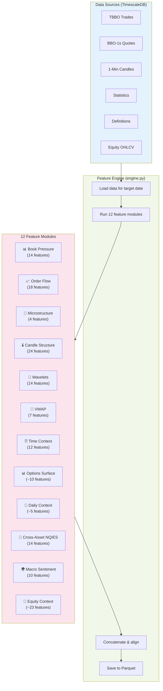

### How Feature Computation Works

Every trading day, the engine:

1. **Loads raw data** from TimescaleDB for that date
2. **Separates futures vs options** quotes using the definitions table
3. **Runs each feature module** — each takes raw data and produces a table of indicators resampled to 10-second bars
4. **Concatenates** all feature tables column-wise (same time index, different columns)
5. **Saves** the combined matrix to a compressed Parquet file (~1 MB per day)

**Output:** One Parquet file per trading day at `data/parquet/features_YYYY-MM-DD.parquet` with ~8,500 rows (10-second bars) × 138 columns.

---

### Feature Modules Explained

#### Module 1: Book Pressure (prefix: `bp_`) — 14 features

**What it measures:** The balance between buyers and sellers at the best prices.

**Plain English:** Imagine a tug-of-war between buyers and sellers. Book pressure measures who's pulling harder. When sellers suddenly pull back (liquidity withdrawal), it often signals a big move is coming.

| Feature | What It Means |
|---------|--------------|
| `bp_spread_mean` | Average gap between best buy and sell prices (wider = more uncertainty) |
| `bp_spread_max` | Widest the gap got in this 10-second window |
| `bp_spread_zscore_6/30/60` | How unusual the current spread is compared to the last 1/5/10 minutes |
| `bp_imbalance` | Ratio of buy vs sell volume at best prices (>0 = more buyers) |
| `bp_imbalance_ma6` | Smoothed version of imbalance over 1 minute |
| `bp_depth_total` | Total number of contracts available at best prices |
| `bp_depth_min` | Minimum depth seen (low depth = thin market = danger) |
| `bp_depth_chg_6/30` | How fast depth is changing (dropping = liquidity withdrawal) |
| `bp_depth_zscore_6/30` | How unusual the depth level is |
| `bp_bid_ask_ratio` | Ratio of buy-side to sell-side volume (persistent pressure direction) |

---

#### Module 2: Order Flow (prefix: `of_`) — 18 features

**What it measures:** The net direction and intensity of actual trades.

**Plain English:** This tracks who's actually buying vs selling. If a flood of buy orders hits the market (positive "delta"), it's aggressive buying. The Cumulative Volume Delta (CVD) keeps a running total — like a scoreboard of buyers vs sellers throughout the day.

| Feature | What It Means |
|---------|--------------|
| `of_delta` | Net buy-sell volume in this 10-second bar |
| `of_delta_pct` | Delta as % of total volume (normalized intensity) |
| `of_buy_ratio` | What fraction of volume was buying |
| `of_trade_count` | Number of individual trades (activity level) |
| `of_cvd_chg_3/6/12/30` | Change in cumulative buy-sell score over various windows |
| `of_delta_sum_3/6/12/30` | Total net delta over various windows |
| `of_delta_zscore_3/6/12/30` | How unusual current delta is vs recent history |
| `of_volume_ma_30` | Average volume over 5 minutes |
| `of_volume_ratio` | Current volume vs the 5-minute average (spikes = important) |

---

#### Module 3: Microstructure (prefix: `ms_`) — 4 features

**What it measures:** Hidden information in the structure of trades.

**Plain English:** Two specialized indicators used by quantitative researchers:
- **VPIN** (Volume-synchronized Probability of Informed Trading): Detects when "smart money" (informed traders) are active — high VPIN means someone knows something the market doesn't.
- **Kyle's Lambda**: Measures how much the price moves per unit of volume — high Lambda means the market is thin and vulnerable to big moves.

| Feature | What It Means |
|---------|--------------|
| `ms_vpin` | Probability that current trading is by informed traders (0–1) |
| `ms_kyle_lambda_30` | Price impact per unit of trade flow (higher = fragile market) |
| `ms_vpin_zscore_30/60` | How unusual the current VPIN level is |

---

#### Module 4: Candle Structure (prefix: `cs_`) — 24 features

**What it measures:** The shape patterns of price bars at multiple timeframes.

**Plain English:** A "candle" shows four prices for a time period: open, high, low, close. The shape of the candle tells a story — a bar that opens low and closes high (bullish candle) means buyers won that period. This module analyzes candle shapes at 1-minute, 5-minute, 15-minute, and 30-minute timeframes.

| Feature | What It Means |
|---------|--------------|
| `cs_body_range_ratio` | How much of the bar's range was the open-to-close move (conviction) |
| `cs_body_direction` | +1 (bullish/up) or -1 (bearish/down) |
| `cs_clv` | Close Location Value — where the close sits within the high-low range (-1 to +1) |
| `cs_clv_ma_2/3/5/10` | Smoothed CLV (persistent directional bias) |
| `cs_upper_shadow` / `cs_lower_shadow` | Rejection wicks — price tried to go higher/lower but got pushed back |
| `cs_range_ma_6/30/60` | Average candle range (volatility proxy) |
| `cs_vol_regime` | Current range vs 5-minute average (regime detection) |
| `cs_range_chg` | How much wider/narrower than the previous bar (expansion/contraction) |
| `cs_clv_bullish_count_*` | How many recent bars closed bullish (streak detection) |
| `cs_5m/15m/30m_body_range` | Body-to-range ratio at higher timeframes |
| `cs_5m/15m/30m_clv` | Close location at higher timeframes |

---

#### Module 5: Wavelets (prefix: `wv_`) — 14 features

**What it measures:** Price movements decomposed into different "speeds" — from fast noise to slow trends.

**Plain English:** Imagine listening to music and separating it into bass, mid-range, and treble. Wavelets do the same thing to price data. The fast scales capture second-to-second noise, while slow scales capture the multi-minute trend. When fast-scale energy exceeds slow-scale energy, the market is in a noisy, unstable state.

| Feature | What It Means |
|---------|--------------|
| `wv_detail_1/2/4/8/16/32` | Price vibrations at each timescale (1-bar to 32-bar) |
| `wv_energy_1/2/4/8/16/32` | Strength of movement at each timescale |
| `wv_approx_slope` | Overall trend direction from the smoothest decomposition level |
| `wv_fine_coarse_ratio` | Ratio of fast-noise energy to slow-trend energy (instability signal) |

---

#### Module 6: VWAP (prefix: `vw_`) — 7 features

**What it measures:** Where the current price sits relative to the Volume-Weighted Average Price.

**Plain English:** VWAP is the "fair value" price for the day — the average price weighted by how many contracts traded at each level. Institutional traders often benchmark to VWAP: prices above VWAP suggest bullish sentiment, below suggests bearish. The further price deviates from VWAP, the more likely it is to snap back.

| Feature | What It Means |
|---------|--------------|
| `vw_vwap_dist` | Distance from VWAP as a fraction (positive = above VWAP) |
| `vw_vwap_zscore_30/60` | How unusually far from VWAP the price is |
| `vw_above_band_1.0/2.0` | Is price > 1 or 2 standard deviations above VWAP? |
| `vw_below_band_1.0/2.0` | Is price > 1 or 2 standard deviations below VWAP? |

---

#### Module 7: Time Context (prefix: `tc_`) — 12 features

**What it measures:** When during the trading day we are, and key reference levels.

**Plain English:** Markets behave differently at different times — the first 5 minutes of regular trading (8:30 CT) are extremely volatile, while midday tends to be quiet. This module tells the model "where in the day" we are, and tracks the opening range (the first 5 and 15 minutes' high/low), which professional traders use as reference levels.

| Feature | What It Means |
|---------|--------------|
| `tc_minutes_into_session` | Minutes since 8:00 CT (session start) |
| `tc_sin_time` / `tc_cos_time` | Cyclical time encoding (helps model learn time-of-day patterns) |
| `tc_dow` | Day of week (0=Monday, 4=Friday) |
| `tc_sin_dow` / `tc_cos_dow` | Cyclical day-of-week encoding |
| `tc_block_*` | Which session block: overnight, premarket, open_5m, open_15m, morning |
| `tc_or5_high/low` | 5-minute opening range high/low |
| `tc_or15_high/low` | 15-minute opening range high/low |
| `tc_or5_breakout_up/down` | Has price broken above/below the 5-minute range? |
| `tc_or15_breakout_up/down` | Has price broken above/below the 15-minute range? |
| `tc_session_progress` | Fraction of regular trading hours elapsed (0→1) |

---

#### Module 8: Options IV Surface (prefix: `iv_`) — ~10 features

**What it measures:** The implied volatility surface from NQ options.

**Plain English:** Options prices embed the market's expectation of future volatility. By computing Implied Volatility (IV) from options prices using the Black-Scholes formula, we can see what the "crowd" expects. High IV = market expects a big move. Skew (puts more expensive than calls) = market is scared of a crash.

> **Note:** Currently disabled — requires NQ.OPT options data which hasn't been backfilled yet.

| Feature | What It Means |
|---------|--------------|
| `iv_atm_mean` | At-the-money implied volatility (market's fear gauge) |
| `iv_skew` | Difference between OTM put IV and OTM call IV (crash fear) |
| `iv_butterfly` | Wing IV minus ATM IV (tail risk expectation) |
| `iv_0dte_atm` | Same-day expiry IV (most sensitive to imminent moves) |
| `iv_atm_chg_*/zscore_*` | Rate of change and unusualness of IV |

---

#### Module 9: Daily Context (prefix: `dc_`) — ~5 features

**What it measures:** Where the current price sits relative to key daily reference levels.

> **Note:** Currently disabled — requires statistics data (daily settlement, high/low, OI).

| Feature | What It Means |
|---------|--------------|
| `dc_prev_settle_dist` | Distance from yesterday's settlement price |
| `dc_daily_high_dist` | Distance from today's high |
| `dc_daily_low_dist` | Distance from today's low |
| `dc_oi_chg` | Change in open interest (new money entering/exiting) |

---

#### Module 10: Cross-Asset NQ/ES (prefix: `ca_`) — 14 features

**What it measures:** Relationship between NQ (Nasdaq-100) and ES (S&P 500) futures.

**Plain English:** NQ and ES usually move together, but when they diverge it's meaningful. If ES drops and NQ doesn't follow, either NQ will catch up (converge) or the divergence signals a regime change. This module tracks correlation, lead-lag relationships, and relative strength.

| Feature | What It Means |
|---------|--------------|
| `ca_corr_30/60/180` | Rolling correlation between NQ and ES returns |
| `ca_ratio` | NQ/ES price ratio (relative valuation) |
| `ca_ratio_zscore_60` | How unusual the ratio is |
| `ca_es_ret_lag1/2` | ES return lagged 1 and 2 bars (does ES lead NQ?) |
| `ca_ret_divergence` | NQ return minus ES return (who's outperforming?) |
| `ca_beta_60/180` | NQ's sensitivity to ES moves |
| `ca_rel_strength_60` | Cumulative NQ outperformance over 10 minutes |
| `ca_es_mom_30` | ES 5-minute momentum (standalone signal) |

---

#### Module 11: Macro Sentiment (prefix: `mx_`) — 10 features

**What it measures:** Volatility regime and fear signals from VIXY (VIX short-term futures ETF).

**Plain English:** VIXY tracks the VIX "fear index." When VIXY spikes, the market is panicking. This module measures the level, momentum, and z-score of VIXY relative to NQ — when fear is elevated, NQ big-down moves are more likely.

| Feature | What It Means |
|---------|--------------|
| `mx_vixy_ret` | VIXY return this bar |
| `mx_vixy_mom_30/60` | VIXY momentum over 5/10 minutes |
| `mx_vixy_zscore_30/60/180` | How unusual VIXY is vs recent history |
| `mx_nq_vixy_corr_30/60` | NQ-VIXY correlation (normally negative — when it breaks, watch out) |
| `mx_vixy_accel` | Rate of change of VIXY momentum (fear acceleration) |
| `mx_vixy_spike` | VIXY vs its 10-minute average (spike detection) |

---

#### Module 12: Equity Context (prefix: `eq_`) — ~23 features

**What it measures:** Signals from key individual stocks and sector ETFs.

**Plain English:** NVDA and TSLA are mega-cap leaders that often move before the broader NQ index. XLK (tech sector ETF) and SMH (semiconductor ETF) show sector rotation. If NVDA is surging and NQ hasn't moved yet, NQ might follow.

| Feature | What It Means |
|---------|--------------|
| `eq_{sym}_mom_30/60` | Momentum of each equity/ETF |
| `eq_{sym}_ret_lag1` | Lagged return (lead-lag signal) |
| `eq_{sym}_corr_60` | Correlation with NQ |
| `eq_{sym}_rel_str_60` | NQ outperformance vs this equity |
| `eq_smh_xlk_ratio` | SMH/XLK ratio (semiconductor vs broad tech rotation) |
| `eq_smh_xlk_zscore_60` | How unusual the SMH/XLK ratio is |
| `eq_breadth_vs_nq` | NQ return minus average equity return (market leadership) |

---

## 6. Step 4 — Label Generation

### What Are Labels?

Labels are the "answers" the model learns from. For each 10-second bar, we look into the future and ask: "Did the price make a big move?" This is only possible during training (we know the future); during prediction, the model must guess.

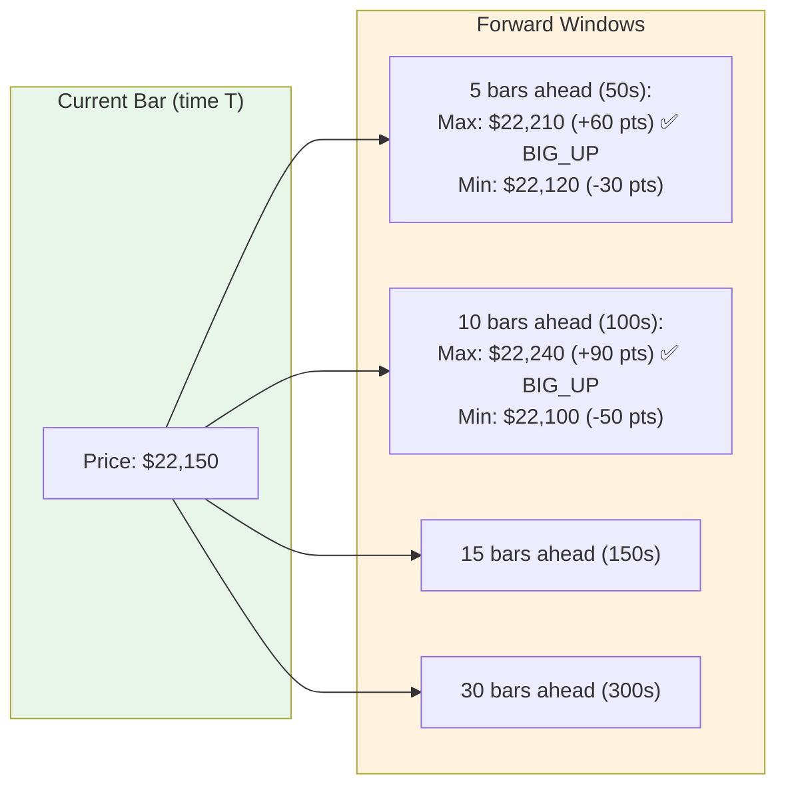

### How Labels Are Created

For each 10-second bar, the system:

1. **Looks ahead** through multiple forward windows (5, 10, 15, 30 bars = 50s, 100s, 150s, 300s)
2. **Finds the maximum upward move** (highest future price − current price)
3. **Finds the maximum downward move** (current price − lowest future price)
4. **Classifies** based on a threshold (default: 50 points ≈ $1,000 per contract):

#### 3-Class Mode (Default)

| If... | Label | Code |
|-------|-------|------|
| Max upward move ≥ 50 pts | **BIG_UP** | 2 |
| Max downward move ≥ 50 pts | **BIG_DOWN** | 0 |
| Neither threshold reached | **CONSOLIDATION** | 1 |

#### 5-Class Mode (Optional)

| If... | Label | Code |
|-------|-------|------|
| Downward ≥ 50 pts | **STRONG_DOWN** | 0 |
| Downward ≥ 25 pts but < 50 | **WEAK_DOWN** | 1 |
| Neither threshold reached | **CONSOLIDATION** | 2 |
| Upward ≥ 25 pts but < 50 | **WEAK_UP** | 3 |
| Upward ≥ 50 pts | **STRONG_UP** | 4 |

**Tie-breaking:** If both up and down thresholds trigger (price whipsawed), the larger move wins. If tied, upward wins.

---

## 7. Step 5 — Data Preprocessing

Before feeding data to the model, several transformations are applied:

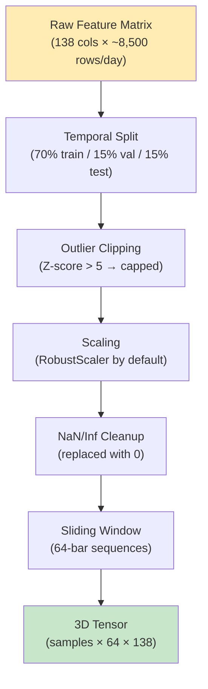

### Step-by-Step:

1. **Temporal Split** — Data is split by time (not shuffled randomly) to prevent future data leaking into training:
   - **Train:** First 70% of all trading days
   - **Validation:** Next 15% (used to tune during training)
   - **Test:** Last 15% (used only for final evaluation)

2. **Outlier Clipping** — Any value more than 5 standard deviations from the training mean is capped. This prevents extreme one-off events from distorting the model.

3. **Scaling** — Features are normalized using a **RobustScaler** (based on median and interquartile range). This makes the model less sensitive to exact magnitudes and focuses on relative patterns. Options: `standard` (mean/std), `robust` (median/IQR), `minmax` (0-1 range).

4. **Sequence Creation** — The model needs to see **a history of recent bars** to make a prediction. A sliding window of 64 bars (= 10.7 minutes at 10-second intervals) is passed across the data. Each "sample" is a 64×138 matrix — 64 time steps, each with 138 features.

---

## 8. Step 6 — Model Architecture

### The Attention-LSTM

The model uses an **Attention-LSTM** architecture — a type of neural network designed for sequential data like time series:

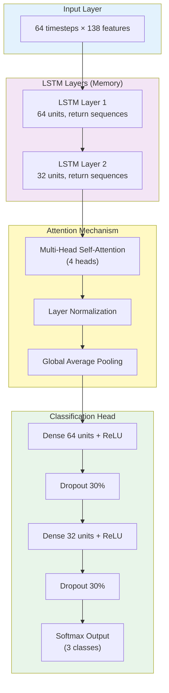

### How Each Component Works (Plain English)

| Component | What It Does | Analogy |
|-----------|-------------|---------|
| **LSTM Layers** | Reads through the 64-bar sequence one step at a time, remembering important patterns and forgetting noise | Like reading a paragraph and remembering the key points |
| **Self-Attention** | Looks back at all 64 bars simultaneously and decides which bars are most important for the current prediction | Like highlighting the most important sentences in a paragraph |
| **4 Attention Heads** | Runs 4 independent attention patterns — one might focus on recent bars, another on unusual bars, etc. | Like 4 readers each highlighting different important things |
| **Layer Normalization** | Stabilizes the attention output to prevent extreme values | Like normalizing test scores to a standard scale |
| **Global Average Pooling** | Compresses the 64-bar attention output into a single summary vector | Like writing a one-sentence summary of a paragraph |
| **Dense Layers** | Standard neural network layers that learn to classify the summary | Like a decision tree that takes the summary and picks a category |
| **Dropout (30%)** | Randomly ignores some neurons during training to prevent overfitting | Like studying with random pages missing — forces deeper understanding |
| **Softmax Output** | Produces probability estimates for each class (BIG_DOWN / CONSOLIDATION / BIG_UP) | Like saying "20% chance of big down, 65% consolidation, 15% big up" |

---

## 9. Step 7 — Training Pipeline

The training pipeline is a **10-step process** orchestrated by `src/training/trainer.py`:

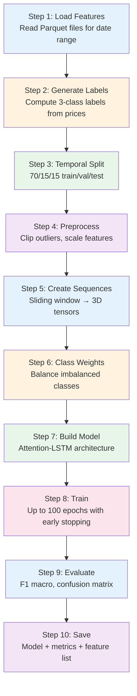

### Training Controls (Preventing Overfitting)

| Mechanism | Setting | What It Does |
|-----------|---------|--------------|
| **Early Stopping** | patience=10 | Stops training if validation loss hasn't improved for 10 epochs |
| **Learning Rate Reduction** | patience=5, factor=0.5 | Halves the learning rate if progress stalls for 5 epochs |
| **Model Checkpointing** | save_best_only=True | Only saves the model when it achieves a new best validation loss |
| **Class Weights** | Inverse-frequency | Gives more importance to rare classes (BIG_UP/BIG_DOWN are rarer than CONSOLIDATION) |
| **Dropout** | 30% | Randomly drops neurons during training to force generalization |

### What Gets Saved

After training, the following artifacts are written to `data/checkpoints/`:

| File | Contents |
|------|----------|
| `model.keras` | Complete trained model (weights + architecture) |
| `training_result.json` | All metrics: accuracy, F1 scores, confusion matrix, training history |
| `features.json` | List of feature columns used, scaler type |

---

## 10. Step 8 — Evaluation & Metrics

### How We Measure Success

The model is evaluated on the **test set** (last 15% of data, never seen during training):

| Metric | What It Measures | Why It Matters |
|--------|-----------------|----------------|
| **Accuracy** | % of correct predictions overall | Basic correctness |
| **F1 Macro** | Average F1 across all classes | The **primary metric** — balances precision and recall equally across all classes |
| **F1 Per-Class** | F1 for each class separately | Shows if the model is good at rare events (BIG_UP, BIG_DOWN) |
| **Confusion Matrix** | Table of predicted vs actual labels | Shows exactly where the model makes mistakes |

### What the Confusion Matrix Looks Like

```
                 Predicted
              DOWN  CONSOL  UP
Actual DOWN  [ TP    FP    FP ]
       CONS  [ FN    TP    FN ]
       UP    [ FP    FP    TP ]
```

**Reading it:** Each row is the actual label, each column is what the model predicted. Diagonal = correct. Off-diagonal = mistakes.

---

## 11. Step 9 — Hyperparameter Optimization

### What Is HPO?

Training a neural network involves many choices (hyperparameters): How large should the LSTM be? What learning rate? How many features? HPO automates this search using **Optuna**.

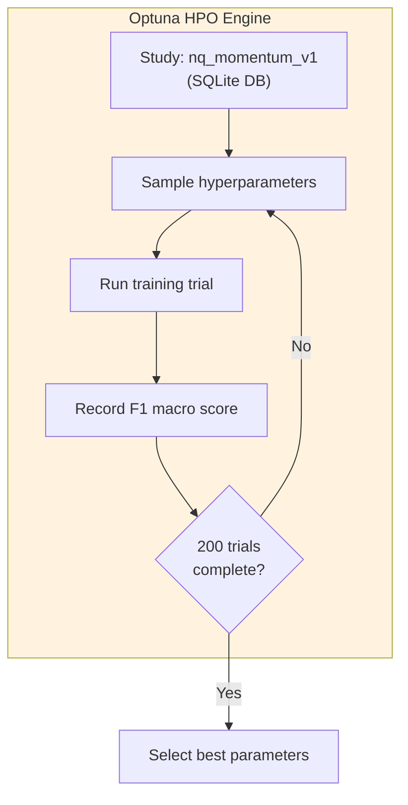

### What Gets Tuned

| Parameter | Search Space | What It Controls |
|-----------|-------------|-----------------|
| `lstm_0` | 64, 128, 256 | Size of first LSTM layer |
| `lstm_1` | 32, 64, 128 | Size of second LSTM layer |
| `attn_heads` | 2, 4, 8 | Number of attention heads |
| `dropout` | 0.1–0.5 | Dropout rate |
| `use_attention` | True, False | Whether to use attention at all |
| `lr` | 0.0001–0.01 | Learning rate |
| `batch` | 32, 64, 128 | Training batch size |
| `seq_len` | 32, 64, 128 | Sequence window length |
| `threshold` | 30–75 | Big-move point threshold |
| `feat_*` | True, False | Enable/disable each feature group |

**Total search space:** ~2.6 million possible combinations. Optuna uses Bayesian optimization to efficiently explore only the most promising areas.

---

## 12. Scheduling & Automation

All services run as **systemd** units (Linux's built-in service manager):

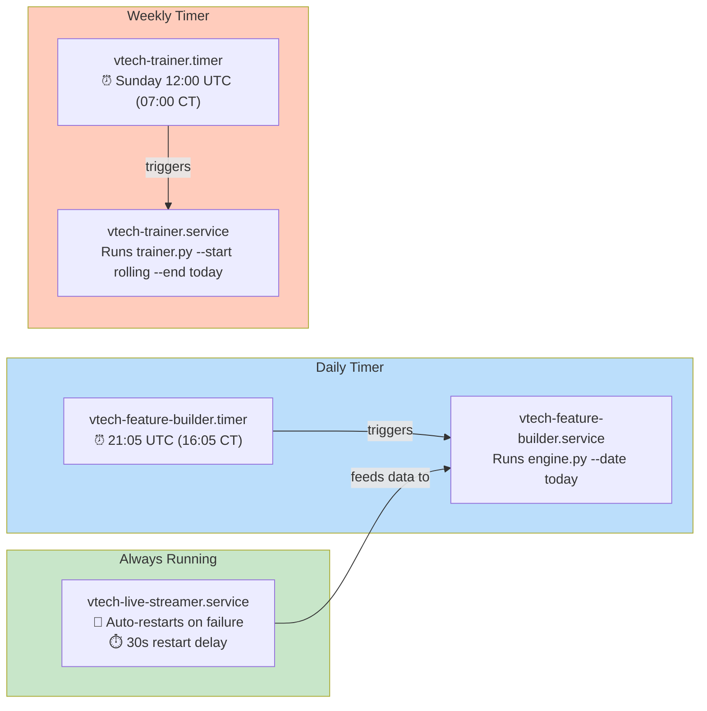

### Service Details

| Service | Type | Memory Limit | Restart Policy |
|---------|------|-------------|----------------|
| `vtech-live-streamer` | `simple` (long-running) | 2 GB | Auto-restart on failure, max 5 restarts per 10 min |
| `vtech-feature-builder` | `oneshot` (run-and-exit) | 4 GB | N/A (timer re-triggers daily) |
| `vtech-trainer` | `oneshot` (run-and-exit) | 16 GB | N/A (timer re-triggers weekly) |

---

## 13. Feature Encyclopedia

### Full Feature Inventory by Module

| # | Module | Prefix | Features | Data Source | Status |
|---|--------|--------|----------|-------------|--------|
| 1 | Book Pressure | `bp_` | 14 | BBO-1s quotes | ✅ Active |
| 2 | Order Flow | `of_` | 18 | TBBO trades | ✅ Active |
| 3 | Microstructure | `ms_` | 4 | TBBO trades | ✅ Active |
| 4 | Candle Structure | `cs_` | 24 | 1-min candles + multi-TF | ✅ Active |
| 5 | Wavelets | `wv_` | 14 | 1-min candles | ✅ Active |
| 6 | VWAP | `vw_` | 7 | TBBO trades | ✅ Active |
| 7 | Time Context | `tc_` | 12 | Timestamp only | ✅ Active |
| 8 | Options Surface | `iv_` | ~10 | NQ.OPT + definitions | ❌ Data not loaded |
| 9 | Daily Context | `dc_` | ~5 | Statistics | ❌ Data not loaded |
| 10 | Cross-Asset | `ca_` | 14 | ES.FUT candles | ⚠️ Disabled by default |
| 11 | Macro Sentiment | `mx_` | 10 | VIXY equity data | ⚠️ Disabled by default |
| 12 | Equity Context | `eq_` | ~23 | NVDA/TSLA/XLK/SMH | ⚠️ Disabled by default |
| | **Total** | | **~138** | | **93 active by default** |

### Feature Naming Convention

All features follow the pattern: `{module_prefix}_{metric_name}_{window}`

- `bp_spread_zscore_30` = **b**ook **p**ressure → spread z-score → 30-bar window
- `of_cvd_chg_12` = **o**rder **f**low → CVD change → 12-bar window
- `cs_5m_clv` = **c**andle **s**tructure → 5-minute → close location value

---

## 14. Configuration Reference

### Key Configuration Parameters

| Parameter | Default | Environment Variable | Description |
|-----------|---------|---------------------|-------------|
| Feature timestep | `10s` | `VTECH_FEATURES_TIMESTEP` | Resample interval for all features |
| Sequence length | `64` | `VTECH_SEQUENCE_LENGTH` | Number of bars the model sees at once (64 × 10s = 10.7 min) |
| Big move threshold | `50` (points) | `VTECH_LABEL_THRESHOLD` | NQ points that define a "big move" (~$1,000/contract) |
| Forward windows | `5,10,15,30` | `VTECH_FORWARD_WINDOWS` | Bars ahead to check for big moves (50s to 5 min) |
| Trading hours | `08:00–11:00 CT` | `VTECH_TRADING_HOURS_*` | Focus window for features |
| Train/Val/Test split | `70/15/15` | — | Temporal data split ratios |
| Scaler | `robust` | — | Feature normalization method |
| LSTM units | `[64, 32]` | — | LSTM layer sizes |
| Attention heads | `4` | — | Multi-head attention count |
| Dense layers | `[64, 32]` | — | Classification head sizes |
| Dropout | `0.3` | — | Regularization rate |
| Batch size | `64` | — | Training batch size |
| Max epochs | `100` | — | Upper limit (early stopping usually triggers earlier) |
| Early stop patience | `10` | — | Epochs without improvement before stopping |
| Learning rate | `0.001` | — | Initial Adam optimizer learning rate |

---

## 15. Glossary

| Term | Definition |
|------|-----------|
| **ATM** | At-The-Money — an option whose strike price equals the current underlying price |
| **BBO** | Best Bid/Offer — the highest buy order and lowest sell order in the market |
| **CLV** | Close Location Value — where the close sits within a bar's high-low range |
| **CVD** | Cumulative Volume Delta — running total of buy volume minus sell volume |
| **DBN** | Databento's proprietary binary data format |
| **Early Stopping** | Halting training when the model stops improving, to prevent overfitting |
| **F1 Score** | Harmonic mean of precision and recall — balances false positives and false negatives |
| **Feature** | A computed numerical indicator used as input to the ML model |
| **Globex** | CME's electronic trading platform where NQ futures trade |
| **HPO** | Hyperparameter Optimization — automated search for best model settings |
| **Hypertable** | TimescaleDB's time-partitioned table format for efficient time-series queries |
| **IV** | Implied Volatility — the market's expectation of future price movement, derived from options prices |
| **Kyle's Lambda** | A measure of price impact per unit of trading volume |
| **LSTM** | Long Short-Term Memory — a neural network architecture designed for sequential data |
| **NQ** | Nasdaq-100 E-mini futures, traded on CME Globex |
| **ES** | S&P 500 E-mini futures, traded on CME Globex |
| **Overfitting** | When a model memorizes training data instead of learning generalizable patterns |
| **Parquet** | A columnar storage format optimized for analytical queries |
| **RTH** | Regular Trading Hours (8:30 AM – 3:00 PM CT for CME products) |
| **Self-Attention** | Neural network mechanism that weighs the importance of each time step relative to all others |
| **Softmax** | Function that converts raw model scores into probabilities (summing to 1) |
| **TBBO** | Trade with Best Bid/Offer — each trade record plus the prevailing best quotes |
| **TimescaleDB** | PostgreSQL extension optimized for time-series data |
| **VIXY** | ProShares VIX Short-Term Futures ETF — a tradeable proxy for market fear |
| **VPIN** | Volume-synchronized Probability of Informed Trading — detects smart-money activity |
| **VWAP** | Volume-Weighted Average Price — the average price weighted by trade volume |
| **Wavelet** | Mathematical tool for decomposing a signal into different frequency components |
| **Z-Score** | Number of standard deviations a value is from the mean — measures unusualness |